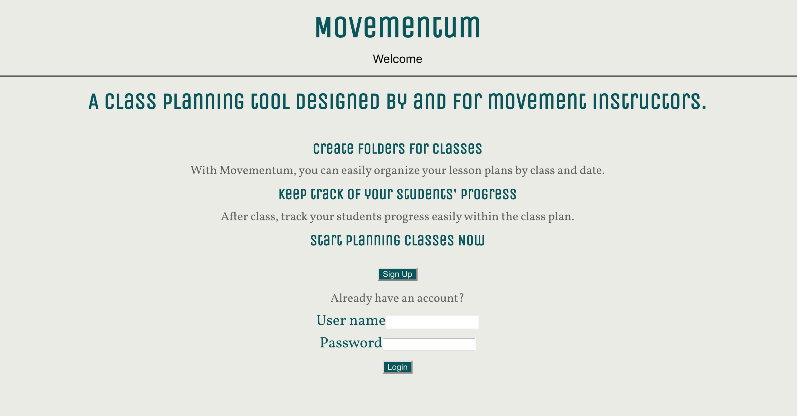
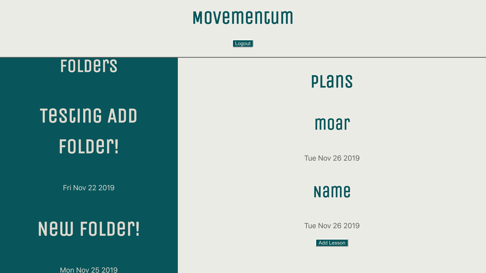
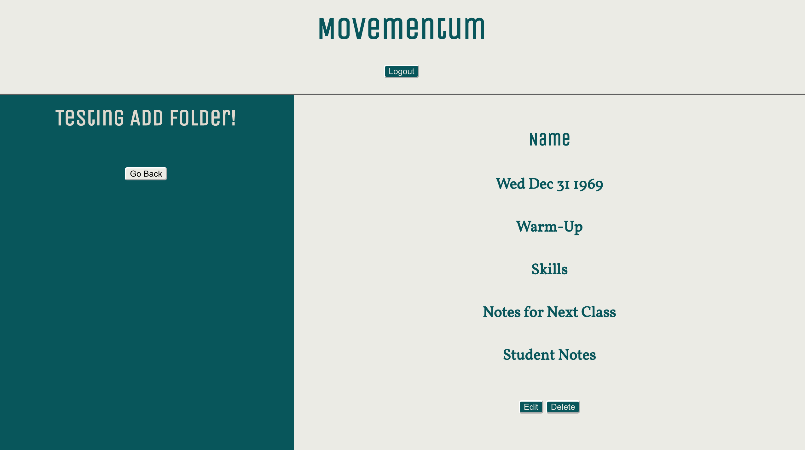

Movementum
==============

Summary
-------
Movementum is a class planning tool designed by and for movement instructors. It fills a gap in class and lesson planning specifically for movement instructors, like dance, yoga, and aerial arts instructors.
Instructors can create folders for classes and organize their lesson plans by class. Instructors can keep track of your students' progress.

Screenshots
-----------

Live [Link](https://movementum.rachaelleeshaw.now.sh/)

Built with:
-----------
Client-side
* HTML5
* CSS
* JavaScript
* React

Server-side
* Node
* Knex
* Express
* PostgreSQL
* Heroku
* Zeit
